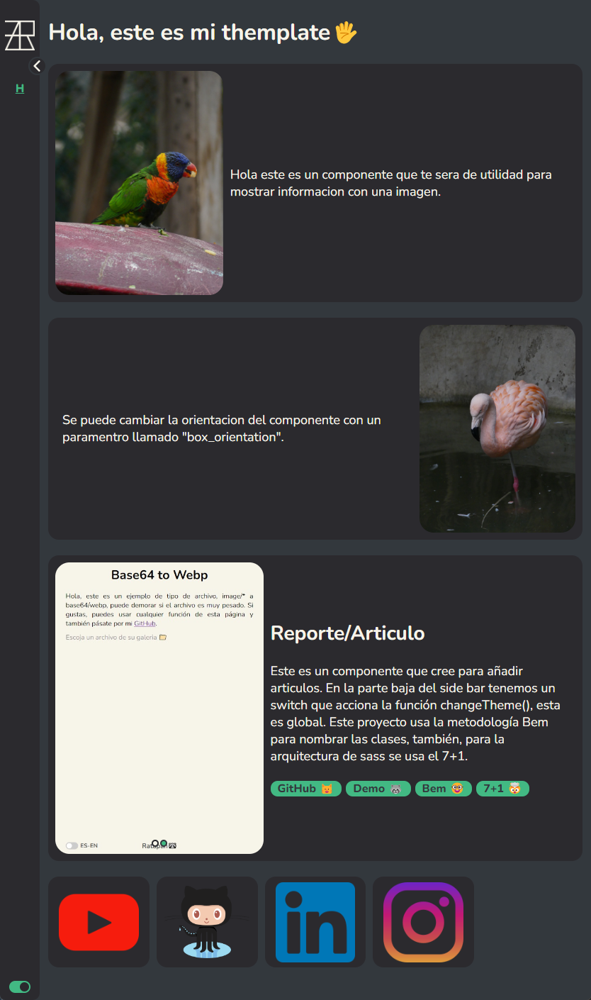

# rtp-themplate

## ¿Qué es esto?
Mi repo "rtp-themplate", es una pequeña ayuda a la comunidad, este tiene elementos básicos y buenas prácticas como la arquitectura 7+1 para el código scss, con un ejemplo de uso de fuentes dentro del proyecto, el uso de router, mixins con una funcionalidad de "cambio de tema" que tuve que hacer, ya que no la encontré nada en internet, usando tambien vue-ls (local storage) y storage, para guardar datos como el tema elegido


## Project setup
```
npm install
npm run serve
```
## Preview
[](https://www.ratapan.com)